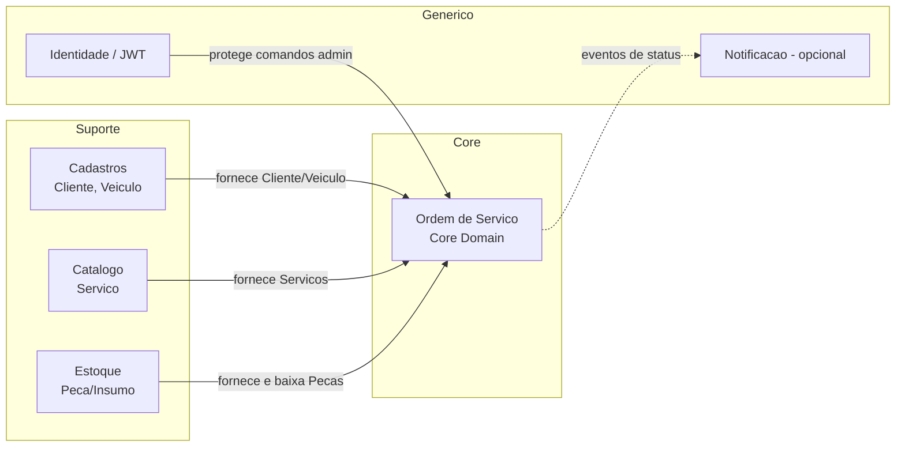
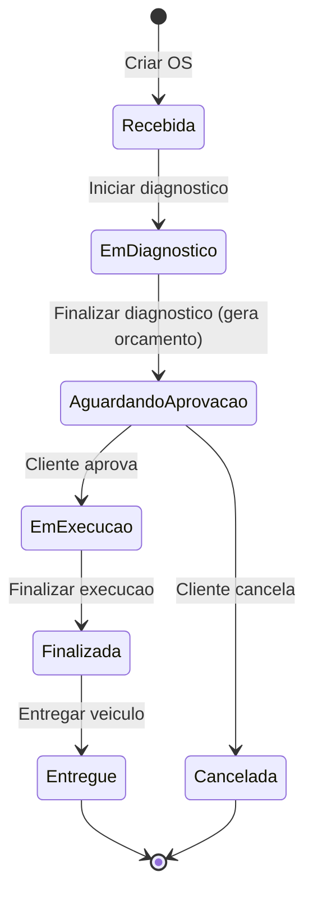

# Documentação DDD — Sistema Integrado de Atendimento e Execução de Serviços (Oficina Mecânica)

> Tech Challenge — FIAP/Pós Tech · Fase 1 · MVP back-end monolítico (arquitetura em camadas, DDD)
> Esta documentação é a fonte da verdade do domínio. Todo o código deve refletir a Linguagem Ubíqua aqui definida.

---

## 1. Visão geral do domínio

Uma oficina mecânica de médio porte precisa substituir anotações manuais e planilhas por um sistema que organize o ciclo completo de uma **Ordem de Serviço (OS)**: identificar cliente e veículo, diagnosticar, orçar, obter aprovação do cliente, executar os serviços com baixa de estoque e entregar o veículo — permitindo ao cliente acompanhar o status via API.

O **núcleo do domínio (Core Domain)** é a **Ordem de Serviço** e sua máquina de estados. Cadastros (cliente, veículo, serviço, peça) e estoque são domínios de suporte que alimentam a OS.

Decisões de escopo (MVP) tomadas a partir dos pontos de atenção do Event Storming estão na seção 9.

---

## 2. Linguagem Ubíqua (glossário)

| Termo | Significado no domínio |
|---|---|
| Ordem de Serviço (OS) | Agregado central. Representa todo o atendimento de um veículo, do recebimento à entrega. |
| Atendente | Ator que identifica cliente/veículo, cria a OS e entrega o veículo. |
| Mecânico | Ator que diagnostica e executa os serviços. |
| Cliente | Pessoa (CPF) ou empresa (CNPJ) dona do veículo; aprova o orçamento e consulta o andamento. |
| Diagnóstico | Etapa em que o mecânico identifica os serviços necessários e as peças/insumos. |
| Serviço | Trabalho oferecido pela oficina (ex.: troca de óleo, alinhamento). |
| Peça / Insumo | Item físico consumido na execução, controlado em estoque. |
| Orçamento | Cálculo automático de valores (serviços + peças + insumos) e previsão de entrega, ligado à OS. |
| Previsão de entrega | Data estimada de conclusão, calculada a partir do tempo dos serviços. |
| Aprovação | Decisão do cliente (via API) de autorizar o orçamento. |
| Baixa de estoque | Redução da quantidade de uma peça/insumo quando é utilizada na execução. |
| Status da OS | Estado atual no ciclo de vida (ver seção 6). |
| Entrega | Devolução do veículo ao cliente, encerrando a OS. |
| Tempo médio de execução | Indicador gerencial: média do tempo entre início e fim de execução. |

---

## 3. Event Storming final (card por card, por fase)

**Cores:** 🟧 Evento · 🟦 Comando · 🟨 Ator · 🟪 Política/automação · 🟩 Modelo de leitura · 🌸 Sistema externo · ⚠️ Ponto de atenção
Linhas verticais `║` marcam **eventos pivotais** (troca de fase/contexto).

### Fase 1 — Identificação  ·  BC: Cadastros  ·  Agregados: Cliente, Veículo
- 🟦 Solicitar atendimento `[🟨 Atendente — cliente presencial]` → 🟧 Atendimento solicitado
- 🟩 Lista de clientes
- 🟦 Identificar cliente por CPF/CNPJ `[🟨 Atendente]` → 🟧 Cliente identificado
  - alt → 🟧 Cliente não encontrado → 🟦 Cadastrar cliente `[🟨 Atendente]` → 🟧 Cliente cadastrado
- 🟩 Lista de veículos do cliente
- 🟦 Identificar veículo pela placa `[🟨 Atendente]` → 🟧 Veículo identificado
  - alt → 🟧 Veículo não encontrado → 🟦 Cadastrar veículo `[🟨 Atendente]` → 🟧 Veículo cadastrado
- 🟧 **Cliente e veículo identificados**  ║ PIVOTAL

### Fase 2 — Criação da OS e Diagnóstico  ·  BC: Ordem de Serviço  ·  Agregado: OrdemServico
- 🟦 Criar OS `[🟨 Atendente]` → 🟧 Ordem de serviço criada
- 🟪 Ao criar OS, definir status = Recebida → 🟧 OS recebida
- 🟩 Lista de OSs abertas
- 🟦 Iniciar diagnóstico `[🟨 Mecânico]` → 🟧 Diagnóstico iniciado
- 🟪 Ao iniciar diagnóstico, alterar status = Em diagnóstico → 🟧 OS em diagnóstico
- 🟩 Catálogo de serviços
- 🟦 Registrar serviço necessário `[🟨 Mecânico]` → 🟧 Serviço necessário registrado
- 🟩 Estoque (peças e insumos)
- 🟦 Registrar peça/insumo necessário `[🟨 Mecânico]` → 🟧 Peça/insumo necessário registrado
- 🟦 Finalizar diagnóstico `[🟨 Mecânico]` → 🟧 **Diagnóstico finalizado**  ║ PIVOTAL
- *Paralelo:* 🟩 Andamento da OS → 🟦 Consultar andamento `[🟨 Cliente — via API]` → 🟧 Andamento consultado
- *Opcional:* 🟪 Quando status mudar, notificar → 🌸 Sistema de Notificação → 🟧 Cliente notificado ⚠️

### Fase 3 — Orçamento e Aprovação  ·  BC: Orçamento (ligado à OS)  ·  Agregado: Orçamento (sub-agregado da OS no MVP)
- 🟪 Ao finalizar diagnóstico, gerar orçamento + calcular previsão (serviços+peças+insumos+estoque) → 🟧 Orçamento gerado
- 🟪 Alterar status = Aguardando aprovação → 🟧 OS aguardando aprovação
- *Opcional:* 🟪 Notificar cliente → 🌸 Sistema de Notificação → 🟧 Cliente notificado do orçamento ⚠️
- 🟩 Orçamento (itens, valores, previsão)
- 🟦 Responder orçamento `[🟨 Cliente — via API]`:
  - 🟧 Orçamento aprovado → 🟧 **OS aprovada pelo cliente**  ║ PIVOTAL
  - alt → 🟧 Item reprovado → 🟦 Remover serviço/peça/insumo da OS `[🟨 Atendente]` → 🟧 Item removido → 🟪 recalcular orçamento ↺
  - alt → 🟧 Solicitação cancelada → 🟪 Alterar status = Cancelada → 🟧 OS cancelada ⚠️
- ⚠️ Política de OS cancelada (ver decisão em 9)

### Fase 4 — Execução  ·  BC: OS + Estoque  ·  Agregados: OrdemServico, Peça/Insumo
- 🟦 Iniciar execução da OS `[🟨 Mecânico]` → 🟧 Execução iniciada
- 🟪 Alterar status = Em execução → 🟧 OS em execução
- 🟩 Lista de serviços da OS
- 🟦 Executar serviço `[🟨 Mecânico]` → 🟧 Serviço executado
- 🟦 Registrar uso de peça/insumo `[🟨 Mecânico]` → 🟧 Peça/insumo utilizado
- 🟪 Ao usar peça, baixar estoque → 🟧 Estoque baixado  ⚠️ (peça sem estoque: ver 9)
- 🟪 *Loop:* enquanto houver serviços pendentes, repetir
- 🟦 Finalizar execução da OS `[🟨 Mecânico]` → 🟧 OS finalizada
- 🟪 Alterar status = Finalizada → 🟧 **OS Finalizada**  ║ PIVOTAL

### Fase 5 — Entrega  ·  BC: OS  ·  Agregado: OrdemServico
- *Opcional:* 🟪 Notificar finalização → 🌸 Sistema de Notificação → 🟧 Cliente notificado ⚠️
- 🟦 Entregar veículo ao cliente `[🟨 Atendente]` → 🟧 Veículo entregue
- 🟪 Alterar status = Entregue → 🟧 **OS entregue**  ║ encerramento

### Transversal (fora da timeline)
- 🟩 Relatório de tempo médio de execução dos serviços
- 🟩 Listagem e detalhamento de OS

---

## 4. Bounded Contexts e Context Map

| Contexto | Tipo | Responsabilidade | Relação |
|---|---|---|---|
| Ordem de Serviço | Core | Ciclo de vida da OS, diagnóstico, orçamento, execução, status | Consome os demais |
| Cadastros | Suporte | CRUD Cliente e Veículo | Upstream da OS |
| Catálogo | Suporte | CRUD Serviço | Upstream da OS |
| Estoque | Suporte | CRUD Peça/Insumo + controle de quantidade | Upstream/baixa pela OS |
| Identidade | Genérico | Usuários admin + JWT | Protege comandos |
| Notificação | Genérico/opcional | Avisos ao cliente | Downstream (eventos) |

No MVP monolítico todos os contextos vivem na mesma solução, separados por **módulos/pastas no Domain** e por **schema lógico** no banco.

---

## 5. Agregados, Entidades, Value Objects e Invariantes

### 5.1 Agregado `Cliente` (raiz)
- Campos: `Id`, `Nome`, `Documento (VO)`, `Email`, `Telefone`.
- Invariantes: Documento válido e único; CPF **ou** CNPJ.
- Atende: PDF "Identificação do cliente por CPF/CNPJ", CRUD de clientes.

### 5.2 Agregado `Veículo` (raiz)
- Campos: `Id`, `ClienteId`, `Placa (VO)`, `Marca`, `Modelo`, `Ano`.
- Invariantes: Placa válida (padrão antigo `AAA-0000` ou Mercosul `AAA0A00`) e única; pertence a um Cliente.
- Atende: PDF "Cadastro de veículo (placa, marca, modelo, ano)", CRUD de veículos.

### 5.3 Agregado `Serviço` (raiz)
- Campos: `Id`, `Nome`, `Descrição`, `ValorBase (Money)`, `TempoEstimado`.
- Invariantes: Valor ≥ 0; tempo estimado > 0.
- Atende: CRUD de serviços; base do orçamento e do tempo de previsão.

### 5.4 Agregado `Peça/Insumo` (raiz)
- Campos: `Id`, `Nome`, `ValorUnitário (Money)`, `QuantidadeEmEstoque`.
- Comportamentos: `Baixar(qtd)` — lança exceção se `qtd > QuantidadeEmEstoque`; `Repor(qtd)`.
- Invariantes: Quantidade nunca negativa.
- Atende: "CRUD de peças e insumos, com controle de estoque" e "baixa de estoque".

### 5.5 Agregado `OrdemServico` (raiz) — **Core**
- Campos: `Id`, `ClienteId`, `VeiculoId`, `Status (enum)`, `ItensServico[]`, `ItensPeca[]`, `Orcamento`, datas de transição (`CriadaEm`, `DiagnosticoIniciadoEm`, `ExecucaoIniciadaEm`, `ExecucaoFinalizadaEm`, `EntregueEm`, `CanceladaEm`).
- Entidades internas:
  - `ItemServico`: `ServicoId`, `Descrição`, `Valor`, `Executado (bool)`.
  - `ItemPeca`: `PecaId`, `Quantidade`, `ValorUnitário`, `Utilizado (bool)`.
  - `Orcamento`: `ValorServicos`, `ValorPecas`, `ValorTotal`, `PrevisaoEntrega`, `GeradoEm`.
- Invariantes / regras (todas no agregado, não no service):
  1. Só registra serviços/peças quando `Status == EmDiagnostico`.
  2. Orçamento só é gerado ao **finalizar diagnóstico**.
  3. Transições de status seguem estritamente a máquina de estados (seção 6).
  4. Execução de serviço e uso de peça só quando `Status == EmExecucao`.
  5. Baixa de estoque ocorre **junto** com o registro de uso da peça.
  6. Cancelamento só permitido em `AguardandoAprovacao`.
  7. `Finalizada` exige todos os serviços marcados como executados.
- Atende: criação/detalhamento de OS, alteração automática de status, orçamento, execução, baixa de estoque, tempo médio.

### 5.6 Value Objects
| VO | Validação |
|---|---|
| `Documento` (CPF/CNPJ) | Dígitos verificadores; normaliza removendo máscara; tipo Pessoa Física/Jurídica. |
| `Placa` | Regex antigo `^[A-Z]{3}-?\d{4}$` e Mercosul `^[A-Z]{3}\d[A-Z]\d{2}$`; uppercase. |
| `Money` | Valor ≥ 0, moeda BRL, arredondamento 2 casas. |
| `Periodo` | Início ≤ fim; usado em previsão e tempo médio. |

### 5.7 Enum `StatusOS`
`Recebida` · `EmDiagnostico` · `AguardandoAprovacao` · `EmExecucao` · `Finalizada` · `Entregue` · `Cancelada` ⚠️

---

## 6. Máquina de estados da OS

| De | Para | Disparo | Tipo |
|---|---|---|---|
| (nova) | Recebida | Criar OS | comando + política |
| Recebida | EmDiagnóstico | Iniciar diagnóstico | comando + política |
| EmDiagnóstico | AguardandoAprovação | Finalizar diagnóstico → gera orçamento | comando + política automática |
| AguardandoAprovação | EmExecução | Aprovar orçamento (cliente) | comando + política |
| AguardandoAprovação | Cancelada | Cancelar (cliente) | comando + política |
| EmExecução | Finalizada | Finalizar execução | comando + política |
| Finalizada | Entregue | Entregar veículo | comando + política |

Qualquer transição fora deste grafo lança `InvalidStatusTransitionException` (regra de domínio).

---

## 7. Políticas (automações) e Sistemas externos

**Políticas (🟪):** definir status Recebida ao criar OS; mudar para Em diagnóstico ao iniciar; gerar orçamento + previsão ao finalizar diagnóstico; mudar para Aguardando aprovação; mudar para Em execução ao aprovar; baixar estoque ao usar peça; mudar para Finalizada/Entregue/Cancelada conforme ação; loop de execução enquanto houver serviços pendentes.

**Sistemas externos (🌸):** Sistema de Notificação — **opcional no MVP**. Modelado como interface `INotificador` com implementação no-op/log. Permite plugar e-mail/SMS/push no futuro sem tocar no domínio.

---

## 8. Modelos de leitura (consultas/relatórios)

| Read Model | Uso | Requisito PDF |
|---|---|---|
| Lista de clientes / veículos | Identificação | Gestão administrativa |
| Catálogo de serviços | Diagnóstico/orçamento | CRUD serviços |
| Estoque (peças e insumos) | Diagnóstico/execução | Controle de estoque |
| Andamento da OS (por cliente) | Consulta pública via API | "Permitir consulta por parte do cliente via API" |
| Listagem e detalhamento de OS | Gestão | "Listagem e detalhamento de ordens de serviço" |
| Relatório de tempo médio de execução | Indicador gerencial | "Monitoramento do tempo médio de execução dos serviços" |

---

## 9. Pontos de atenção e decisões do MVP

| # | Dúvida de negócio/escopo | Decisão MVP proposta |
|---|---|---|
| 1 | Status "Cancelada" não consta na lista do PDF | Adicionar como status terminal extra (necessário para o fluxo de cancelamento). |
| 2 | OS cancelada: apagar já / após 30 dias / só alterar? | **Soft-delete**: status Cancelada + `CanceladaEm`, nunca apagar fisicamente (preserva histórico). |
| 3 | Notificação ativa ao cliente é obrigatória? | **Não** no MVP. Obrigatório é só consulta via API. Manter `INotificador` plugável. |
| 4 | Peça sem estoque na execução | Bloquear a baixa e retornar erro de domínio. Compra a fornecedor fica **fora do MVP**. |
| 5 | "Solicitar atendimento" é via app? | Não. É presencial; modelado como ação do Atendente que abre o atendimento. |
| 6 | Fluxo de compra/Estoquista/Fornecedor (no ES original) | **Removido** do MVP (não consta no PDF). Registrado como backlog futuro. |
| 7 | Pagamento | Fora do MVP (futuro). |

---

## 10. Rastreabilidade — Requisito do PDF → Elemento de domínio

| Requisito (PDF) | Onde é atendido |
|---|---|
| Identificação por CPF/CNPJ | VO `Documento`, agregado `Cliente`, comando Identificar cliente |
| Cadastro de veículo (placa, marca, modelo, ano) | VO `Placa`, agregado `Veículo` |
| Inclusão de serviços solicitados | `ItemServico` na OS, comando Registrar serviço |
| Incluir peças e insumos | `ItemPeca` na OS, agregado `Peça/Insumo` |
| Orçamento automático | Política "gerar orçamento", entidade `Orcamento` |
| Envio do orçamento p/ aprovação | Status `AguardandoAprovacao`, comando Responder orçamento |
| Status (6 estados) + alteração automática | Enum `StatusOS` + políticas de transição |
| Consulta pelo cliente via API | Read model "Andamento da OS" (endpoint público) |
| CRUD clientes/veículos/serviços/peças | Agregados de suporte + controllers |
| Controle de estoque / baixa | `Peça.Baixar()`, política "baixar estoque" |
| Listagem e detalhamento de OS | Read models de OS |
| Tempo médio de execução | Datas de transição na OS + read model relatório |
| JWT para APIs administrativas | BC Identidade, `[Authorize]` |
| Validação CPF/CNPJ e placa | VOs `Documento` e `Placa` |
| Testes unitários e integração | Domínio (regras) + WebApplicationFactory |

---

## 11. Atores

| Ator | Comandos |
|---|---|
| Atendente | Identificar/cadastrar cliente e veículo, Criar OS, Remover item, Entregar veículo |
| Mecânico | Iniciar/finalizar diagnóstico, Registrar serviço/peça, Iniciar/executar/finalizar execução |
| Cliente | Consultar andamento (API), Responder orçamento (aprovar/reprovar/cancelar) |
| Admin | CRUDs administrativos, gestão de usuários |

---

*Documento de referência do domínio. Próximo passo: aprovação para iniciar o código por camada (backlog técnico, item 1 — Fundação).*
