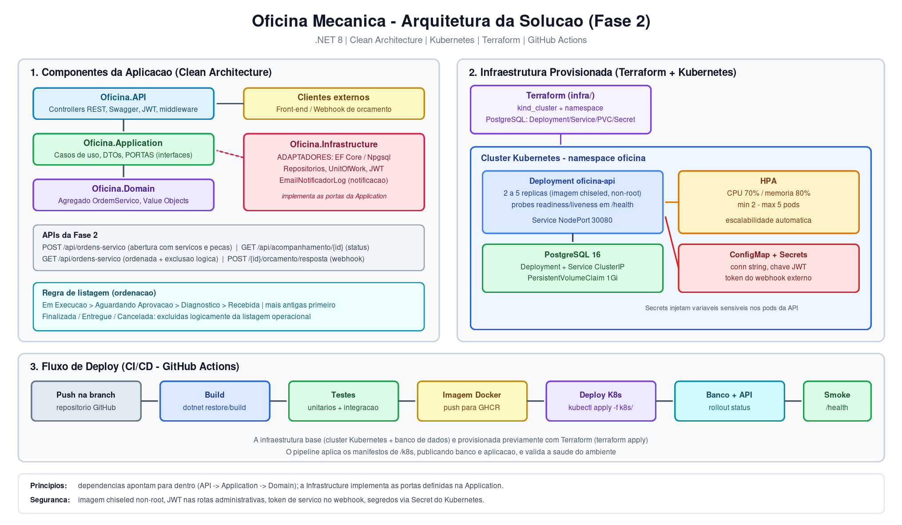
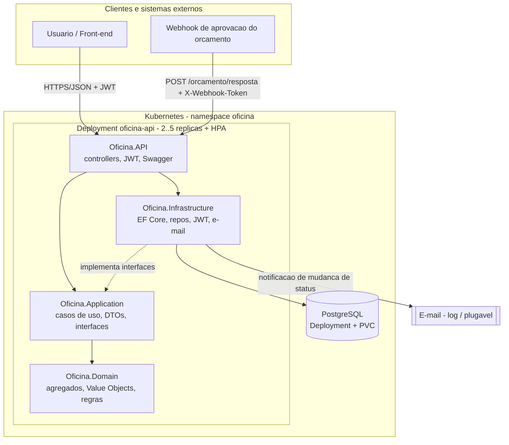
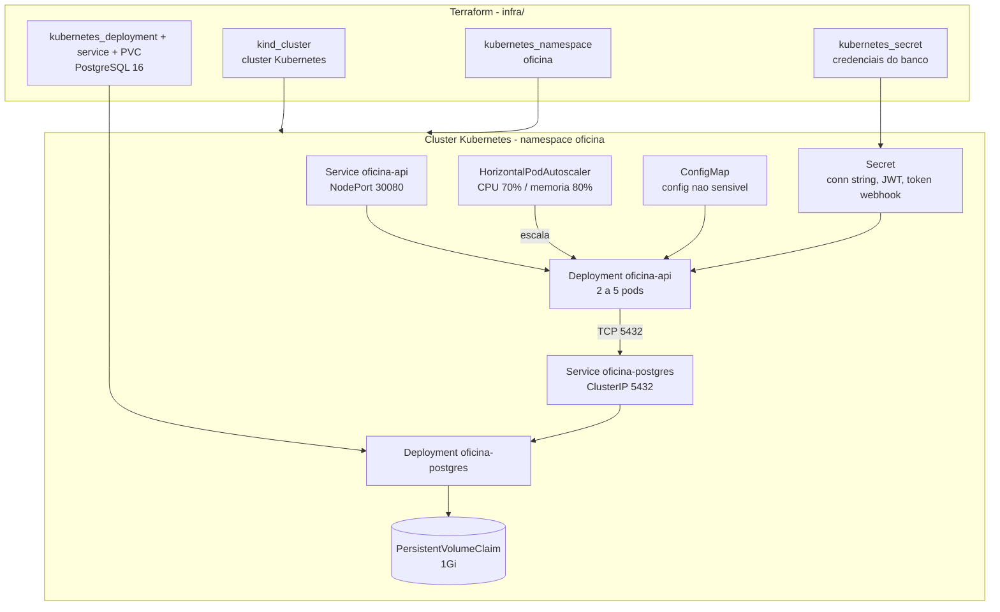
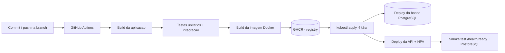

# Oficina Mecânica - Sistema Integrado de Atendimento e Execução de Serviços

MVP back-end do Tech Challenge Oficina Mecânica - **Fase 1**, evoluído na **Fase 2** com
Clean Architecture, novos casos de uso (webhook de aprovação, notificação por e-mail e listagem
ordenada) e esteira de infraestrutura (Kubernetes, Terraform e CI/CD).

O projeto implementa um sistema para atendimento de oficina mecânica, cobrindo
cadastro de clientes e veículos, catálogo de serviços, controle de peças e
insumos, criação e acompanhamento de Ordens de Serviço (OS), orçamento
automático, autorização, execução, baixa de estoque e entrega do veículo.

## Índice

- [Oficina Mecânica - Sistema Integrado de Atendimento e Execução de Serviços](#oficina-mecânica---sistema-integrado-de-atendimento-e-execução-de-serviços)
  - [Índice](#índice)
  - [Objetivo da Entrega (Fase 1)](#objetivo-da-entrega-fase-1)
  - [Objetivo da Fase 2](#objetivo-da-fase-2)
  - [Stack Utilizada](#stack-utilizada)
  - [Como Rodar o Projeto](#como-rodar-o-projeto)
    - [Opção 1 - Docker Compose](#opção-1---docker-compose)
    - [Opção 2 - Local com .NET](#opção-2---local-com-net)
  - [Como Testar os Endpoints com Swagger](#como-testar-os-endpoints-com-swagger)
  - [Links da Entrega](#links-da-entrega)
  - [Arquitetura](#arquitetura)
    - [Diagrama de Arquitetura](#diagrama-de-arquitetura)
    - [Infraestrutura Provisionada](#infraestrutura-provisionada)
    - [Camadas](#camadas)
  - [Principais Domínios](#principais-domínios)
  - [Fluxo da Ordem de Serviço](#fluxo-da-ordem-de-serviço)
  - [Endpoints](#endpoints)
    - [Públicos](#públicos)
    - [Clientes](#clientes)
    - [Veículos](#veículos)
    - [Serviços](#serviços)
    - [Peças e Insumos](#peças-e-insumos)
    - [Ordens de Serviço](#ordens-de-serviço)
  - [Autenticação JWT](#autenticação-jwt)
  - [Banco de Dados](#banco-de-dados)
  - [Testes](#testes)
    - [Opção 1 - Com .NET SDK local](#opção-1---com-net-sdk-local)
    - [Opção 2 - Sem instalar .NET, usando Docker](#opção-2---sem-instalar-net-usando-docker)
  - [Qualidade e Segurança](#qualidade-e-segurança)
  - [Novidades da Fase 2](#novidades-da-fase-2)
  - [Kubernetes](#kubernetes)
  - [Infraestrutura (Terraform)](#infraestrutura-terraform)
  - [CI/CD (GitHub Actions)](#cicd-github-actions)
    - [Fluxo de Deploy](#fluxo-de-deploy)
  - [Collection das APIs e Video](#collection-das-apis-e-video)
  - [Entregáveis da Fase 1](#entregáveis-da-fase-1)
  - [Entregáveis da Fase 2](#entregáveis-da-fase-2)

## Objetivo da Entrega (Fase 1)

Atender ao descritivo da Fase 1 do Tech Challenge:

- back-end monolítico em camadas;
- aplicação de DDD nos domínios centrais;
- APIs REST documentadas com Swagger;
- autenticação JWT para APIs administrativas;
- validação de CPF/CNPJ e placa de veículo;
- testes unitários e de integração nos fluxos principais;
- Dockerfile e docker-compose para execução simples;
- justificativa do banco de dados;
- relatório de vulnerabilidades;
- documento de entrega em PDF.

## Objetivo da Fase 2

Evoluir a aplicação da Fase 1 para garantir **qualidade, resiliência e escalabilidade**,
incorporando práticas modernas de infraestrutura e automação.

**A solução:** a API de gestão de ordens de serviço foi refatorada segundo **Clean Architecture**
(dependências apontando para o domínio, portas na Application e adaptadores na Infrastructure),
ganhou novos casos de uso de negócio e passou a ser publicada em **Kubernetes** com
autoescalonamento, sobre infraestrutura provisionada por **Terraform** e entregue por uma
**pipeline de CI/CD**.

Objetivos atendidos nesta fase:

- refatoração com Clean Code e Clean Architecture, mantendo os testes automatizados dos fluxos críticos;
- abertura de OS recebendo cliente, veículo, serviços e peças, retornando o identificador único;
- consulta do status atual da OS;
- aprovação/recusa do orçamento por **notificação externa (webhook)**;
- listagem de OS ordenada por status, mais antigas primeiro, com **exclusão lógica** das finalizadas/entregues;
- atualização de status comunicada por **e-mail**;
- conteinerização revisada (Dockerfile + docker-compose);
- orquestração em **Kubernetes** (Deployments, Services, ConfigMaps/Secrets e HPA por CPU/memória);
- **infraestrutura como código** com Terraform (cluster Kubernetes + banco de dados);
- **CI/CD** executando build, testes, imagem Docker e deploy do banco e da aplicação no cluster.

## Stack Utilizada

- .NET 8 / ASP.NET Core Web API
- Entity Framework Core 8 + Npgsql
- PostgreSQL 16
- FluentValidation
- Swagger / OpenAPI (Swashbuckle)
- JWT Bearer
- PBKDF2 para hash de senha
- xUnit + FluentAssertions
- WebApplicationFactory + Testcontainers para testes de integração
- Coverlet para coleta de cobertura
- Docker / Docker Compose
- SonarQube Community e Trivy para qualidade e segurança

## Como Rodar o Projeto

### Opção 1 - Docker Compose

Pré-requisito: Docker Desktop em execução.

```bash
docker compose up --build
```

URLs:

- API: http://localhost:8080
- Swagger: http://localhost:8080/swagger
- Liveness: http://localhost:8080/health/live
- Readiness (inclui PostgreSQL): http://localhost:8080/health/ready

No primeiro start, o schema e os dados seed são criados automaticamente:

- serviços iniciais;
- peças/insumos iniciais;
- usuário admin.

### Opção 2 - Local com .NET

Pré-requisitos:

- .NET 8 SDK;
- PostgreSQL acessível.

Suba apenas o banco pelo Compose:

```bash
docker compose up -d db
```

Rode a API:

```bash
dotnet restore
dotnet build
dotnet run --project src/Oficina.API
```

URL esperada:

- Swagger: http://localhost:5080/swagger

## Como Testar os Endpoints com Swagger

1. Acesse o Swagger:
   - Docker: http://localhost:8080/swagger
   - Local dotnet: http://localhost:5080/swagger
2. Execute `POST /api/auth/login` com:

```json
{
  "username": "admin",
  "password": "admin123"
}
```

3. Copie o campo `token` retornado.
4. Clique em `Authorize` no topo do Swagger e informe o token. Se a interface pedir o header completo, use `Bearer {token}`.
5. Execute o fluxo principal:
   - `POST /api/clientes`
   - `POST /api/veiculos`
   - `GET /api/servicos` e copie um `servicoId`
   - `GET /api/pecas-insumos` e copie um `pecaId`
   - `POST /api/ordens-servico`
   - `POST /api/ordens-servico/{id}/iniciar-diagnostico`
   - `POST /api/ordens-servico/{id}/servicos`
   - `POST /api/ordens-servico/{id}/pecas`
   - `POST /api/ordens-servico/{id}/finalizar-diagnostico`
   - `POST /api/ordens-servico/{id}/aprovar`
   - `POST /api/ordens-servico/{id}/servicos/{itemId}/executar`
   - `POST /api/ordens-servico/{id}/pecas/{itemId}/usar`
   - `POST /api/ordens-servico/{id}/finalizar-execucao`
   - `POST /api/ordens-servico/{id}/entregar`
6. Consulte o andamento público sem token:
   - `GET /api/acompanhamento/{id}`
7. Consulte o relatório gerencial:
   - `GET /api/ordens-servico/relatorios/tempo-medio`

## Links da Entrega

- Documentação DDD / Event Storming (Miro): https://miro.com/app/board/uXjVHDVaKxg=/?share_link_id=818426939332
- Repositório: https://github.com/menta2010/tech-challenge-oficina-mecanica
- Documento de entrega: `docs/DOCUMENTO-ENTREGA.pdf`
- Relatório de vulnerabilidades: `docs/RELATORIO-VULNERABILIDADES.md`

## Arquitetura

O projeto é um monolito em camadas, com separação entre API, casos de uso,
domínio e infraestrutura.

```text
src/
  Oficina.API/
    Controllers/
    Middlewares/
    Program.cs
  Oficina.Application/
    Abstractions/
    Clientes/
    Estoque/
    Identidade/
    OrdensServico/
    Servicos/
    Veiculos/
  Oficina.Domain/
    Clientes/
    Estoque/
    Identidade/
    OrdensServico/
    Servicos/
    Shared/
    Veiculos/
  Oficina.Infrastructure/
    Identity/
    Persistence/
tests/
  Oficina.UnitTests/
  Oficina.IntegrationTests/
docs/
  evidências, relatórios e documento de entrega
```

### Camadas

- `Oficina.API`: controllers REST, Swagger, autenticação/autorização, middleware global de erros e health checks.
- `Oficina.Application`: services/casos de uso, DTOs, validadores e interfaces de repositório.
- `Oficina.Domain`: entidades, Value Objects, agregados, enums e regras de negócio.
- `Oficina.Infrastructure`: EF Core, PostgreSQL, configurações de entidades, repositórios, UnitOfWork, JWT, hash de senha e seed.
- `tests`: testes unitários do domínio e testes de integração da API com PostgreSQL real via Testcontainers.

Fluxo de dependência: `API -> Application -> Domain`. A Infrastructure implementa
as interfaces da Application e é injetada na API.

### Diagrama de Arquitetura



> Desenho completo da arquitetura escolhida (componentes da aplicacao, infraestrutura
> provisionada e fluxo de deploy). Arquivo editavel: `docs/Arquitetura-Fase2.svg`.
> Os diagramas abaixo detalham cada parte.




Na Fase 2 o desenho segue **Clean Architecture**: as dependências sempre apontam para dentro
(API -> Application -> Domain) e a Infrastructure implementa as portas definidas na Application,
de modo que o núcleo de negócio não conhece detalhes de banco, e-mail ou HTTP.

### Infraestrutura Provisionada



Recursos criados: cluster Kubernetes (kind, via Terraform), namespace `oficina`, banco PostgreSQL
(Deployment + Service + PVC + Secret) e, sobre ele, a API (Deployment + Service NodePort +
ConfigMap + Secret) com autoescalonamento por HPA.

## Principais Domínios

- **Cliente**: cadastro e identificação por CPF/CNPJ via Value Object `Documento`.
- **Veículo**: vinculado ao cliente, com placa validada nos formatos antigo e Mercosul.
- **Serviço**: catálogo de serviços, valor base e tempo estimado.
- **Peça/Insumo**: cadastro, valor unitário, estoque, reposição e baixa.
- **OrdemServico**: agregado central; controla status, itens, orçamento e timestamps.
- **Identidade**: usuário administrativo, hash PBKDF2 e emissão de token JWT.

## Fluxo da Ordem de Serviço

Status previstos no desafio:

1. `Recebida`
2. `EmDiagnostico`
3. `AguardandoAprovacao`
4. `EmExecucao`
5. `Finalizada`
6. `Entregue`

O sistema também possui `Cancelada` como estado adicional para representar
recusa/cancelamento do orçamento.

Fluxo ponta a ponta:

1. Criar cliente e veículo.
2. Criar OS para cliente/veículo.
3. Iniciar diagnóstico.
4. Adicionar serviços e peças/insumos.
5. Finalizar diagnóstico, gerando orçamento automaticamente.
6. Aprovar orçamento ou cancelar OS.
7. Executar serviços e registrar uso de peças.
8. Baixar estoque ao usar peça.
9. Finalizar execução.
10. Entregar veículo.
11. Consultar acompanhamento público da OS.

## Endpoints

### Públicos

| Método | Rota | Descrição |
|---|---|---|
| GET | `/health/live` | Liveness da aplicação |
| GET | `/health/ready` | Readiness da aplicação, incluindo conexão com PostgreSQL |
| GET | `/health` | Alias compatível de readiness |
| GET | `/api/health` | Health check via controller |
| POST | `/api/auth/login` | Login administrativo |
| GET | `/api/acompanhamento/{id}` | Consulta pública do andamento da OS |

### Clientes

| Método | Rota |
|---|---|
| POST | `/api/clientes` |
| GET | `/api/clientes` |
| GET | `/api/clientes/{id}` |
| PUT | `/api/clientes/{id}` |
| DELETE | `/api/clientes/{id}` |

### Veículos

| Método | Rota |
|---|---|
| POST | `/api/veiculos` |
| GET | `/api/veiculos` |
| GET | `/api/veiculos?clienteId={clienteId}` |
| GET | `/api/veiculos/{id}` |
| PUT | `/api/veiculos/{id}` |
| DELETE | `/api/veiculos/{id}` |

### Serviços

| Método | Rota |
|---|---|
| POST | `/api/servicos` |
| GET | `/api/servicos` |
| GET | `/api/servicos/{id}` |
| PUT | `/api/servicos/{id}` |
| DELETE | `/api/servicos/{id}` |

### Peças e Insumos

| Método | Rota |
|---|---|
| POST | `/api/pecas-insumos` |
| GET | `/api/pecas-insumos` |
| GET | `/api/pecas-insumos/{id}` |
| PUT | `/api/pecas-insumos/{id}` |
| POST | `/api/pecas-insumos/{id}/reabastecer` |
| DELETE | `/api/pecas-insumos/{id}` |

### Ordens de Serviço

| Método | Rota | Descrição |
|---|---|---|
| POST | `/api/ordens-servico` | Abre OS (cliente, veículo e, opcionalmente, serviços e peças) |
| GET | `/api/ordens-servico` | Lista OS **ativas**, ordenadas por status (exclui finalizadas/entregues/canceladas) |
| GET | `/api/ordens-servico?status={status}` | Lista por status |
| GET | `/api/ordens-servico/{id}` | Detalha OS |
| POST | `/api/ordens-servico/{id}/iniciar-diagnostico` | Muda para diagnóstico |
| POST | `/api/ordens-servico/{id}/servicos` | Adiciona serviço |
| DELETE | `/api/ordens-servico/{id}/servicos/{itemId}` | Remove item de serviço do orçamento |
| POST | `/api/ordens-servico/{id}/pecas` | Adiciona peça |
| DELETE | `/api/ordens-servico/{id}/pecas/{itemId}` | Remove item de peça do orçamento |
| POST | `/api/ordens-servico/{id}/finalizar-diagnostico` | Gera orçamento |
| POST | `/api/ordens-servico/{id}/aprovar` | Aprova orçamento |
| POST | `/api/ordens-servico/{id}/cancelar` | Cancela OS |
| POST | `/api/ordens-servico/{id}/orcamento/resposta` | **Webhook** de aprovação/recusa externa do orçamento (header `X-Webhook-Token`) |
| POST | `/api/ordens-servico/{id}/servicos/{itemId}/executar` | Marca serviço executado |
| POST | `/api/ordens-servico/{id}/pecas/{itemId}/usar` | Usa peça e baixa estoque |
| POST | `/api/ordens-servico/{id}/finalizar-execucao` | Finaliza execução |
| POST | `/api/ordens-servico/{id}/entregar` | Entrega veículo |
| GET | `/api/ordens-servico/relatorios/tempo-medio` | Tempo médio de execução |

## Autenticação JWT

As APIs administrativas exigem token JWT. Endpoints públicos:

- `GET /health`, `GET /health/live` e `GET /health/ready`
- `GET /api/health`
- `POST /api/auth/login`
- `GET /api/acompanhamento/{id}`

Usuário seed:

| Username | Senha | Role |
|---|---|---|
| `admin` | `admin123` | `Admin` |

Login:

```http
POST /api/auth/login
Content-Type: application/json

{
  "username": "admin",
  "password": "admin123"
}
```

No Swagger, clique em `Authorize` e informe o token retornado. Em clientes HTTP,
use `Authorization: Bearer {token}`.

As senhas são armazenadas com PBKDF2 SHA-256, 100k iterações e salt aleatório.
Em ambiente real, altere `Jwt__SecretKey` e `SEED_ADMIN_PASSWORD` por variáveis
de ambiente.

## Banco de Dados

Banco escolhido: **PostgreSQL**.

Justificativa:

1. Gratuito e open-source, sem barreira de licença.
2. Maduro, confiável e ACID, adequado para transações entre OS, orçamento e estoque.
3. Boa integração com .NET via EF Core e Npgsql.
4. Execução simples em container com imagem oficial.
5. Possui recursos avançados para evolução futura.

A persistência é isolada por interfaces na Application e implementações na
Infrastructure, reduzindo acoplamento com o banco.

No startup, `DbInitializer.InitializeAsync` aplica migrations se existirem; caso
contrário, usa `EnsureCreated()` para criar o schema do MVP.

## Testes

Os testes podem ser executados de duas formas.

### Opção 1 - Com .NET SDK local

Pré-requisitos:

- .NET 8 SDK instalado;
- Docker Desktop em execução para os testes de integração.

Rodar todos os testes:

```bash
dotnet test
```

Rodar com cobertura:

```bash
dotnet test --collect:"XPlat Code Coverage"
```

### Opção 2 - Sem instalar .NET, usando Docker

Esta opção usa a imagem oficial do SDK .NET 8. Para rodar todos os testes,
incluindo os testes de integração com Testcontainers, o comando monta o socket
do Docker para permitir que o Testcontainers suba o PostgreSQL temporário.

```bash
docker run --rm \
  -e TESTCONTAINERS_HOST_OVERRIDE=host.docker.internal \
  -v "$PWD":/src \
  -w /src \
  -v /var/run/docker.sock:/var/run/docker.sock \
  mcr.microsoft.com/dotnet/sdk:8.0 \
  dotnet test
```

No macOS com Docker Desktop, `TESTCONTAINERS_HOST_OVERRIDE=host.docker.internal`
é importante porque os testes rodam dentro do container SDK, mas os containers
do Testcontainers são criados pelo Docker do host. Sem essa variável, os testes
unitários podem passar, mas os testes de integração podem falhar com
`ResourceReaperException`.

Se ainda houver erro no `ResourceReaper`/Ryuk em execução local, rode com o Ryuk
desabilitado para esta chamada:

```bash
docker run --rm \
  -e TESTCONTAINERS_HOST_OVERRIDE=host.docker.internal \
  -e TESTCONTAINERS_RYUK_DISABLED=true \
  -v "$PWD":/src \
  -w /src \
  -v /var/run/docker.sock:/var/run/docker.sock \
  mcr.microsoft.com/dotnet/sdk:8.0 \
  dotnet test
```

Para rodar somente os testes unitários, sem precisar do Testcontainers:

```bash
docker run --rm \
  -v "$PWD":/src \
  -w /src \
  mcr.microsoft.com/dotnet/sdk:8.0 \
  dotnet test tests/Oficina.UnitTests
```

Observação: os testes de integração exigem Docker, pois usam Testcontainers com
PostgreSQL real. O comando com `docker.sock` deve ser executado na raiz do
projeto.

Cobertura declarada nas evidências: **95,1%**, acima da meta mínima de 80% nos
domínios críticos.

Cobertura funcional:

- CPF/CNPJ, placa e valor monetário;
- regras de estoque;
- ciclo de vida e transições da OS;
- autenticação e rotas protegidas;
- CRUDs administrativos;
- fluxo completo da OS com baixa de estoque;
- consulta pública de acompanhamento.

## Novidades da Fase 2

Evolução do MVP mantendo o domínio, agora com **Clean Architecture**, novos casos de uso e
esteira de infraestrutura (Kubernetes, Terraform e CI/CD).

### Novas/ajustadas APIs

- **Abertura de OS** (`POST /api/ordens-servico`): além de cliente e veículo, aceita opcionalmente
  as listas de `servicos` e `pecas` já identificadas, retornando o identificador único da OS.
  Quando itens são informados, a OS já entra em diagnóstico com eles registrados.

- **Listagem operacional ordenada** (`GET /api/ordens-servico`): por padrão lista apenas as OS
  **ativas**, ordenadas por status **Em Execução > Aguardando Aprovação > Em Diagnóstico > Recebida**
  e, dentro de cada status, as **mais antigas primeiro**. As OS **Finalizada/Entregue/Cancelada**
  são excluídas **logicamente** da listagem (permanecem no banco; acessíveis por `?status=`).
- **Aprovação/recusa por notificação externa (webhook)**
  (`POST /api/ordens-servico/{id}/orcamento/resposta`): endpoint público que recebe a decisão do
  cliente (`{ "aprovado": true|false, "motivo": "..." }`), protegido por **token de serviço** no
  header `X-Webhook-Token` (injetado via `Secret` no Kubernetes). Aprovado → **Em execução**;
  recusado → **Cancelada**.
- **Notificação de status por e-mail**: a cada mudança de status a aplicação dispara notificação
  pela porta `INotificadorEmail` (Application). A implementação atual (`EmailNotificadorLog`,
  Infrastructure) registra o envio em log; trocar por SMTP/serviço de e-mail não altera o domínio.

## Kubernetes

Manifestos em `k8s/`: `Namespace`, `Deployment`/`Service` da API e do PostgreSQL, `ConfigMap`,
`Secret`s (connection string, chave JWT, token do webhook) e `HorizontalPodAutoscaler` (CPU, 2→5
réplicas). Passo a passo em `k8s/README.md`.

```bash
kubectl apply -f k8s/
kubectl -n oficina rollout status deploy/oficina-api
kubectl -n oficina port-forward svc/oficina-api 8080:80   # http://localhost:8080/swagger
```

## Infraestrutura (Terraform)

Código em `infra/`: provisiona um cluster Kubernetes local (**kind**) e o **banco de dados
PostgreSQL**. Detalhes em `infra/README.md`.

```bash
cd infra
terraform init && terraform apply
```

## CI/CD (GitHub Actions)

Pipeline em `.github/workflows/ci-cd.yml`, em três estágios: **Build & Test** (restore, build e
testes unitários + integração com Testcontainers, com cobertura), **Docker image** (build e push
da imagem para o GHCR) e **Deploy to Kubernetes** (cluster kind efêmero, carga da imagem,
`kubectl apply -f k8s/` e smoke test em `/health/ready`).

### Fluxo de Deploy



Etapas: o push dispara o pipeline, que compila, roda os testes, publica a imagem no
registry e aplica os manifestos no cluster (banco e API), finalizando com verificacao
de saude. A infraestrutura base (cluster + banco) e provisionada com Terraform (`infra/`).

## Qualidade e Segurança

Evidências em `docs/`:

- `Scan_Vulnerabilidade_Sonar_Antes_De_Corrigir.png`
- `Scan_Vulnerabilidade_Sonar_Depois_De_Corrigir.png`
- `Activity_Sonar.png`
- `sonar-issues_de_corrigir.json`
- `Scan_Vulnerabilidade_Trivy_Antes_De_Corrigir.html`
- `trivy-depois.html`
- `RELATORIO-VULNERABILIDADES.md`

Resumo:

- SonarQube: issues iniciais analisadas e corrigidas/justificadas.
- Trivy: imagem inicial baseada em Debian apresentou CVEs de SO; imagem final
  usa runtime chiseled/non-root, reduzindo o total para 6 achados LOW/MEDIUM e
  sem CRITICAL/HIGH.
- Dependências .NET revisadas, sem CVEs aplicáveis nas versões utilizadas.

## Collection das APIs e Video

- **Collection completa das APIs:** a documentacao interativa (Swagger/OpenAPI) fica disponivel
  em `http://localhost:8080/swagger` com a aplicacao em execucao. O arquivo OpenAPI pode ser
  importado no Postman/Insomnia a partir de `http://localhost:8080/swagger/v1/swagger.json`.
  _Link da collection publicada: **adicionar aqui**._
- **Video demonstrativo (ate 15 min):** _adicionar link do YouTube/Vimeo aqui._
  O video deve demonstrar: deploy da aplicacao, execucao do CI/CD, consumo das APIs e
  escalabilidade automatica (HPA sob carga).

## Entregáveis da Fase 1

| Requisito | Status | Evidência |
|---|---|---|
| Back-end monolítico | OK | Solução `.sln` em camadas |
| Arquitetura em camadas | OK | `src/Oficina.*` |
| DDD | OK | Agregados e Value Objects em `Oficina.Domain` + Miro |
| CRUD clientes | OK | `ClientesController` |
| CRUD veículos | OK | `VeiculosController` |
| CRUD serviços | OK | `ServicosController` |
| CRUD peças/insumos com estoque | OK | `PecasInsumosController` |
| Criação de OS | OK | `OrdensServicoController` |
| Orçamento automático | OK | `OrdemServico.FinalizarDiagnostico` |
| Status automáticos da OS | OK | agregado `OrdemServico` |
| Consulta da OS pelo cliente | OK | `AcompanhamentoController` |
| Tempo médio de execução | OK | `/relatorios/tempo-medio` |
| JWT nas APIs administrativas | OK | `[Authorize]` + `AddJwtBearer` |
| Validação CPF/CNPJ | OK | `Documento` |
| Validação placa | OK | `Placa` |
| Swagger | OK | `Program.cs` |
| Dockerfile | OK | `Dockerfile` |
| docker-compose | OK | `docker-compose.yml` |
| Testes automatizados | OK | `tests/` |
| Cobertura mínima de 80% | OK | evidências de 95,1% |
| README explicativo | OK | este arquivo |
| Relatório de vulnerabilidades | OK | `docs/RELATORIO-VULNERABILIDADES.md` |
| Documento de entrega PDF | OK |
| Acesso ao usuário `soat-architecture` | OK|

## Entregáveis da Fase 2

| Requisito | Status | Evidência |
|---|---|---|
| Clean Architecture (portas/adaptadores) | OK | `Oficina.Application/Abstractions` + implementações na Infrastructure |
| Aprovação do orçamento via webhook externo | OK | `POST /api/ordens-servico/{id}/orcamento/resposta` (token `X-Webhook-Token`) |
| Listagem ordenada por status + exclusão lógica | OK | `OrdemServicoService.ListarAsync` + `OrdemServicoRepository.ListAtivasAsync` |
| Notificação de mudança de status por e-mail | OK | `INotificadorEmail` + `EmailNotificadorLog` |
| Manifestos Kubernetes (Deployments, Services, ConfigMap/Secret, HPA) | OK | `k8s/` |
| Terraform (cluster + banco) | OK | `infra/` |
| Pipeline CI/CD (build, testes, imagem, deploy K8s) | OK | `.github/workflows/ci-cd.yml` |
| Testes dos novos fluxos | OK | `tests/Oficina.IntegrationTests/OrdemServicoFase2Tests.cs` |

